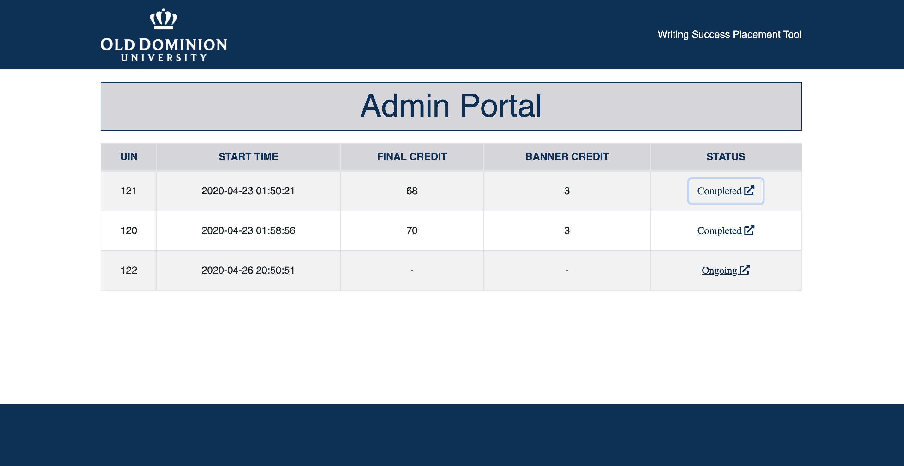

# Quiz Web Application.
This project demonstrate a full-stack quiz app, with the student and the Admin view.
The quiz is a multi page view and 

### DB connection 
-  connection.php

### Ajax calls 
- addToDB.php

### Sections 
- contains individual testing sections (reading/writing/grammar assessment.. and so on and so forth)  
 
### For Testing
- Sections/readingAssessment 
  - line 42 contians the main logic for random and limit and  line 43 contains normal fetch from the DB.
- Sections/grammarAssessment 
  - line 24 contians the main logic for random and limit and line 25 contains normal fetch from the DB.

> Begin by importing the sql dumps in mysql 
> then start the server and load index.php to begin the test
> After completion of the test you will be redirected to test.php for further notifications.

## How does the quiz web app looks 
#### Index.html

#### Modal pop up before starting the quiz.

#### If input box left blank then a student can't submit.

#### if Checkbox left uncheckek an error will pop up

#### Final popup after the test completion.

#### Admin View 

